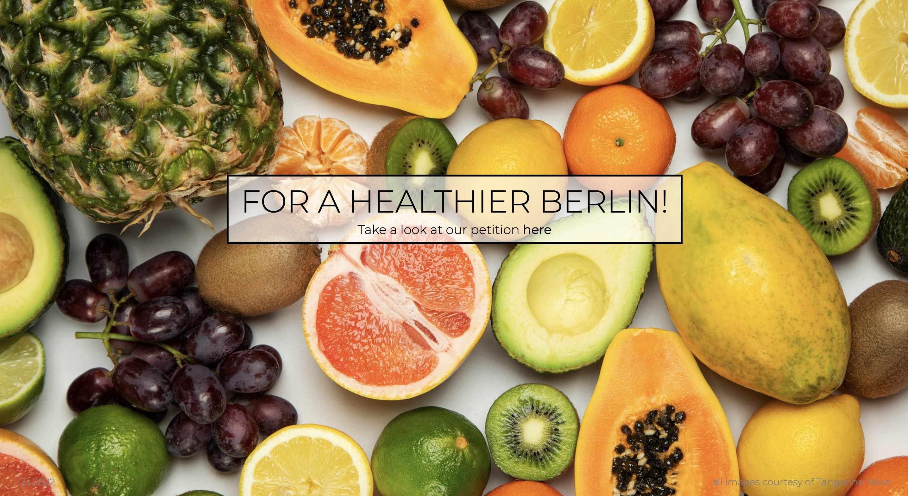
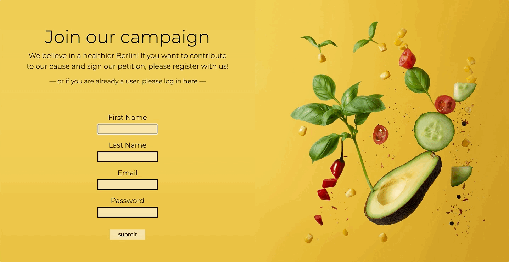
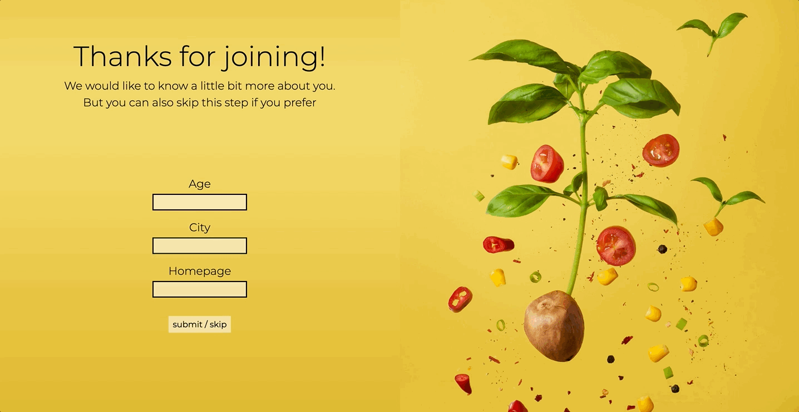
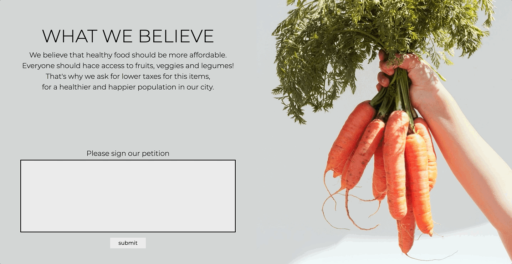
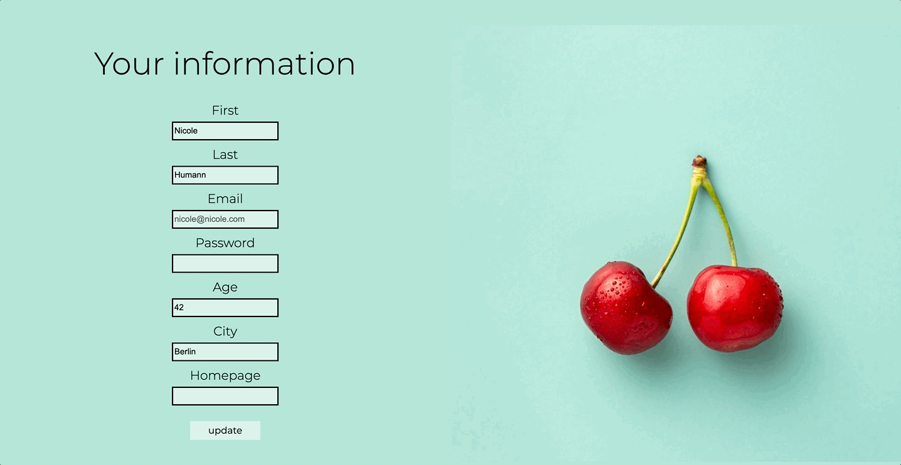

# for a healthier berlin

*project done during the SPICED academy Full Stack Web Development bootcamp*  

## overview  
This is an online petition where people can give their support to this cause. 
> We believe that healthy food should be more affordable. Everyone should hace access to fruits, veggies and legumes!   That's why we ask for lower taxes for this items, for a healthier and happier population in our city.  

It has a visually attractive layout with brigth colors to capture the essence of the petition topic.

- Registration and Login page with error display
- Bcrypt for password protection
- Form for additional (optional) information
- Personal information can be updated 
- Signature visible in real time 
- List of fellow supporters available with their location
- Signature can be deleted

Note: This website is not yet optimised for small screens, please take a look on a laptop or a bigger screen.  

## previews  

**start page**  
visually attractive design that catches the eye and invites to know more

**register & login page**  
all basic functionalities and error displays

**additional data**  
optional additional user data

**signature**  
real time signature, and thank you page

**profile update**  
possibility to update all the information about the user  

